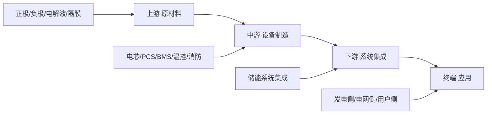

# 储能行业全景图

> **数据基准**：2025年度数据（SMM/InfoLink/Wood Mackenzie 综合）
> 全球储能电芯出货 612.39 GWh，同比 +94.59%；全球储能系统出货 167.1 GWh（H1），同比 +85.7%

## 行业竞争格局总览

| 环节 | 集中度 | 格局特征 |
|------|--------|----------|
| 电芯 | CR10 88.8%，CR6 ~75% | 一超多强，座次轮换激烈 |
| PCS | 阳光电源 28%-35% | 一超多强，国产主导 |
| 系统集成 | CR10 60.2% | 高度分散，中企 8/10 席 |
| BMS/温控/消防 | 相对分散 | 细分龙头 + 区域性玩家 |

## 产业链

## 上游 — 原材料

- 正极材料 (碳酸锂 / 磷酸铁)
- 负极材料 (石墨 / 硅碳)
- 电解液 (LiPF6)
- 隔膜 (湿法 / 干法)
- 结构件 (铝壳 / 顶盖)

### 上游供应商梯队

| 梯队     | 企业   | 细分领域     | 优势关键词             | 劣势关键词         |
| ------ | ---- | -------- | ----------------- | ------------- |
| **T1** | 天赐材料 | 电解液      | 全球龙头、一体化成本优势、绑定宁德 | 产能过剩致价格承压     |
| **T1** | 恩捷股份 | 隔膜(湿法)   | 湿法隔膜全球第一、客户全覆盖    | 干法份额低、海外工厂爬坡慢 |
| **T1** | 德方纳米 | 磷酸铁锂正极   | LFP正极龙头、液相法成本低    | 产品同质化、毛利率波动大  |
| **T1** | 贝特瑞  | 负极(石墨)   | 天然石墨全球第一、硅碳布局早    | 人造石墨份额不及杉杉    |
| **T2** | 杉杉股份 | 负极(人造石墨) | 人造石墨龙头、客户结构优      | 海外布局偏慢        |
| **T2** | 星源材质 | 隔膜(干法)   | 干法隔膜龙头、出口比例高      | 湿法产能追赶中       |
| **T2** | 新宙邦  | 电解液      | 技术品质优、海外布局领先      | 规模不及天赐        |
| **T2** | 湖南裕能 | 磷酸铁锂正极   | 产能规模大、绑定比亚迪       | 客户集中度高        |

## 中游 — 设备制造

### 电芯供应商梯队

> 2025年总计出货排名：宁德时代 → 海辰储能 → 亿纬锂能 → 中创新航 → 瑞浦兰钧（SMM）
> 全球大储Top5：宁德时代 → 海辰储能 → 亿纬锂能 → 中创新航 → 比亚迪储能（InfoLink）
> 全球小储Top3：瑞浦兰钧 → 亿纬锂能 → 鹏辉能源

**第一梯队**

| 企业       | 2025排名    | 优势                                      | 劣势                    | 主力型号                       |
| -------- | --------- | --------------------------------------- | --------------------- | -------------------------- |
| **宁德时代** | #1（市占26%） | 技术领先(500Ah+量产/钠电)、海外大储占比>40%、全球能源巨头深度绑定 | 市占率从37.9%降至26%、被新势力蚕食 | 314Ah/587Ah(EnerOne+) / 钠电 |
| **海辰储能** | #2（最大黑马）  | 产能近百GWh、海外订单>33GWh、极致制造降本、扭亏为盈          | 品牌积淀浅、国内市场相对弱         | 314Ah / 587Ah              |
| **亿纬锂能** | #3        | 五大六小客户基本盘稳、大储+小储双轮驱动、海外产能(匈牙利/马来)、赴港上市  | 被海辰超越、大储增速放缓          | LF280K / LF560K / 628Ah    |

**第二梯队**

| 企业 | 2025排名 | 优势 | 劣势 | 主力型号 |
|------|----------|------|------|----------|
| **中创新航** | #4(↑2位) | 深度绑定阳光电源+中车株洲所、车储一体产能、出货>45GWh | 品牌知名度待提升、海外布局起步 | 314Ah / 392Ah |
| **瑞浦兰钧** | #5 | 小储绝对龙头(连冠)、欧洲渠道深、模块化适配海外 | 大储份额偏低 | 100Ah / 314Ah(Wending) |
| **比亚迪(弗迪)** | #6 | 垂直一体化(自产自用)、刀片电池技术、海外出货第二 | 外销比例低、受海辰/瑞浦挤压 | 刀片电池 / Cube Pro |
| **远景动力** | #7(↑1位) | 全球三地产能(中日英)、资源优势、绑定远景能源 | 出货规模仍在中游 | 305Ah / 315Ah |
| **鹏辉能源** | #8 | 小储增速领跑(>80%)、欧洲户用爆发、工商业储能放量 | 大储赛道缺席 | 100Ah / 150Ah |

**第三梯队 / 新势力**

| 企业 | 特征 | 优势 | 劣势 |
|------|------|------|------|
| **楚能新能源** | 2025最大黑马 | 价格优势、地方能源集团绑定、储能+绿电模式 | 品牌弱、技术积累浅 |
| **欣旺达** | 绑定头部集成商起量 | 消费电子底蕴、684Ah供阳光电源 | 储能专注度不足 |
| **中汽新能** | 增速前三 | 客户网络优、H2放量暴增 | 持续性待验证 |
| **国轩高科** | 大众背书 | 海外布局(美国/德国/越南)、LFP技术 | 储能出货量偏小 |

### PCS 供应商梯队

> EESA 2024 Top15：阳光电源、科华数能、上能电气、索英电气、汇川技术、南瑞继保、许继电力电子、英博电气、特变电工、禾望电气、中车时代电气、盛弘股份、海得新能源、智光储能、科士达
> CNPP 2026十大品牌：阳光电源、上能、科华数能、索英电气、南瑞继保、汇川、盛弘股份、许继电气、禾望、英博

| 梯队 | 企业 | 市占参考 | 优势 | 劣势 | 主力型号 |
|------|------|----------|------|------|----------|
| **T1** | 阳光电源 | 28%-35%全球 | 全球绝对龙头、集中式+组串式全覆盖、液冷技术领先、海外渠道最强 | 估值偏高、竞品追赶 | SG3425HV-MV / PowerTitan 3.0 |
| **T1** | 上能电气 | ~10% | 大型储能/电网侧强势、构网型技术突出、央企客户绑定 | 海外布局弱于阳光 | EH-3450-HA-UD |
| **T1-T2** | 科华数能 | — | 工商业+电网侧均衡、模块化优势、数据中心协同、UPS基因 | 品牌力弱于前二 | BCS系列 |
| **T2** | 索英电气 | — | 专注储能PCS 20年、技术积淀深、效率高 | 规模偏小 | ES系列 |
| **T2** | 南瑞继保 | — | 电网背景强、构网型方案领先、央企背书 | 市场化程度偏低 | PCS-9560 |
| **T2** | 汇川技术 | — | 工控基因(Top1)、成本控制强、渠道广 | 储能专注度待提升 | MD880系列 |
| **T2** | 盛弘股份 | — | 模块化PCS领先、海外认证齐全(UL/IEC) | 整体规模偏小 | PWS系列 |
| **T2** | 许继电气 | — | 国网系、电网侧项目资源丰富 | 灵活性不足 | — |
| **T2** | 特变电工 | ~5% | 电力电子龙头、构网型PCS认证领先、5MW变流升压一体机 | 储能PCS起步晚于专业厂商 | 435kW构网型PCS / TE-125kW一体柜 |
| **T2** | 中车时代电气 | — | 轨道交通电气底蕴、IGBT自主可控、大功率PCS技术强 | 储能PCS专注度待提升 | 5MW变流升压一体机 |
| **T2** | 科士达 | — | 数据中心UPS全球Top5、海外渠道完善、户储PCS出货靠前 | 大储PCS份额低 | GBL系列 / 户储PCS |
| **T3** | 禾望电气 | — | 风电变流器龙头延伸储能、大功率PCS性价比高 | 储能品牌力偏弱、户储少 | HV系列PCS |
| **T3** | 英博电气 | — | 光伏逆变器协同、性价比路线、电网投标经验丰富 | 品牌认知度偏低 | — |
| **T3** | 海得新能源 | — | 风电PCS技术同源、产品可靠性好、工商业方案灵活 | 整体规模偏小 | 模块化PCS |
| **T3** | 智光储能 | — | 高压级联PCS技术特色(6-35kV直入网)、柔直技术强 | 中小功率段弱 | 高压级联PCS |
| **T3** | 固德威 | — | 全球PV逆变器Top10、户储PCS强、光储一体化、海外渠道深 | 大储PCS起步 | ET系列 / SMT系列 |
| **T3** | 锦浪科技 | — | PV逆变器全球前三、工商业储能PCS布局快、组串式技术强 | 大储PCS缺位 | 储能PCS系列 |

### BMS 供应商梯队

| 梯队 | 企业 | 优势 | 劣势 |
|------|------|------|------|
| **T1** | 协能科技 | 储能BMS出货第一、主动均衡技术领先、客户覆盖Top电芯厂 | 海外认证进度中等 |
| **T1** | 高特电子 | 技术积淀深、电网侧项目经验丰富 | 规模扩张速度放缓 |
| **T2** | 科工电子 | 产品性价比高、工商业储能优势 | 大型储能案例偏少 |
| **T2** | 华塑科技 | 上市企业、数据中心BMS协同 | 储能专注度不足 |
| **T2** | 宁波拜特 | 海外认证领先(UL/IEC)、出口优势 | 国内份额偏低 |

### 温控 供应商梯队

| 梯队 | 企业 | 优势 | 劣势 | 主力方案 |
|------|------|------|------|----------|
| **T1** | 英维克 | 储能温控绝对龙头、液冷方案成熟、大储案例最多 | 价格偏高 | 全链条液冷 |
| **T1** | 同飞股份 | 技术品质出色、工业温控经验丰富 | 品牌力弱于英维克 | 液冷机组 |
| **T2** | 申菱环境 | 特种空调背景、军工级品质 | 储能份额低 | 风冷/液冷 |
| **T2** | 高澜股份 | 液冷技术领先(电网背景)、特高压协同 | 储能规模偏小 | 液冷方案 |

### 消防 供应商梯队

| 梯队 | 企业 | 优势 | 劣势 | 主力产品 |
|------|------|------|------|----------|
| **T1** | 国安达 | 储能消防第一股、气溶胶+水消防全方案、大储项目案例最多 | 行业标准仍在迭代 | 储能专用消防系统 |
| **T1** | 及安盾 | 气溶胶灭火技术全球领先、纳米粒子灭火原创、UL/EN/AS认证、PACK级精准防护、日产2.7万套 | 专注气溶胶赛道、水消防布局弱 | QRR系列 / JAD300-U01 |
| **T1** | 青鸟消防 | 消防行业龙头、渠道网络广、品牌强 | 储能专注度待提升 | 火灾报警+灭火联动 |
| **T2** | 正华同安 | 火报+灭火全流程一站式、储能电站复合灭火、2000+项目/25GWh、出口东南亚 | 综合规模偏小、品牌认知低于头部 | 火灾报警控制装置 / 热气溶胶灭火 |
| **T2** | 千页科技 | 专注锂电热失控监测预警、电池舱灭火全方案、定制+施工验收一站式、液冷案例 | 成立时间短(2019)、品牌积累不足 | KZ01-QY/KZ02-QY 报警控制器 |
| **T2** | 中消云 | 储能消防新锐、性价比高 | 案例积累偏少 | 气溶胶灭火 |
## 海外储能供应商（系统/PCS/集成）

> 全球系统集成商排名（2025 H1，InfoLink/WoodMac综合）：
> 阳光电源 #1 → 特斯拉 #2 → 比亚迪 #3 → 中车株洲所 #4 → 海博思创 #5
> Top10中仅特斯拉、Fluence 两家非中资企业

### 海外主要玩家

| 企业              | 国别  | 环节     | 全球排名        | 优势                                  | 劣势                        | 主力产品/型号                                   |
| --------------- | --- | ------ | ----------- | ----------------------------------- | ------------------------- | ----------------------------------------- |
| **Tesla**       | 美国  | 系统集成   | #2（北美39%市占） | 品牌+AI+垂直整合、Megapack标准化、上海工厂投产、北美独大  | 中国市场份额低、价格高、供应受限          | Megapack 2XL（3.9MWh）/ 上海工厂版               |
| **Fluence**     | 美国  | 系统集成   | Top5        | Siemens+AES合资背景、全球项目经验最丰富、软件平台(OS)强 | 硬件依赖外采、盈利能力弱              | Gridstack / Ultrastack                    |
| **SMA**         | 德国  | PCS/系统 | —           | 光伏逆变器全球龙头(欧洲)、户储/工商业PCS技术深厚、品牌百年    | 大储份额弱、中国成本竞争压力大           | Sunny Central Storage / Sunny Boy Storage |
| **Wärtsilä**    | 芬兰  | 系统集成   | Top15       | 电力系统深度理解、GEMS软件平台强、全球运维网络           | 退出储能制造倾向、战略摇摆             | GridSolv Quantum                          |
| **Powin**       | 美国  | 系统集成   | Top10       | 软硬件解耦模式灵活、宁德电芯深度合作、美国本土优势           | 品牌弱于Tesla/Fluence、盈利能力待验证 | Stack 750 / Centipede                     |
| **LGES**        | 韩国  | 电芯/系统  | —（重回Top10）  | 北美产能释放、韩系品牌+IRA政策红利、三元技术            | 此前逐年下滑、磷酸铁锂起步晚            | TR1300 / JP5                              |
| **Samsung SDI** | 韩国  | 电芯     | —           | 三元电池技术领先、安全性口碑好                     | 储能LFP滞后、暂时离场Top10         | PRiMX                                     |
| **BYD(海外)**     | 中国  | 电芯+系统  | #3          | 全球渠道、垂直一体化、刀片电池差异化                  | 海外建厂进度慢于预期                | MC Cube / Blade Battery                   |
| **Hyperstrong** | 中国  | 系统集成   | Top10       | 海外布局早、新兴市场渗透深                       | 国内品牌力偏弱                   | —                                         |

### 海外PCS / 逆变器代表

| 企业 | 国别 | 优势 | 劣势 | 主力型号 |
|------|------|------|------|----------|
| **SMA** | 德国 | 欧洲第一光伏逆变器品牌、户储+工商业PCS全覆盖、电网适应性最强 | 大储份额低、成本高 | Sunny Central 系列 |
| **Power Electronics** | 西班牙 | 大储PCS全球出货领先(欧美)、功率密度高 | 亚太市场弱 | HEC V1500 |
| **ABB** | 瑞士 | 电力电子底蕴深、工业级品质 | 储能专注度不足、已部分退出 | — |
| **Ingeteam** | 西班牙 | 欧洲本土PCS强、定制化能力强 | 规模偏小 | INGECON SUN STORAGE |
| **TMEIC** | 日本 | 日本/美国市场强、东芝+三菱合资背景 | 全球覆盖面窄 | SOLAR WARE |

## 下游 — 系统集成

### 系统集成商梯队（2025 H1 全球 Top10）

| 梯队     | 企业         | 全球排名       | 优势                                              | 劣势         | 主力方案                   |
| ------ | ---------- | ---------- | ----------------------------------------------- | ---------- | ---------------------- |
| **T1** | 阳光电源       | #1（14-16%） | 全球第一、PCS+集成一体化、PowerTitan 3.0(684Ah)、海外大单>35GWh | 北美关税风险     | PowerTitan 3.0         |
| **T1** | 比亚迪        | #3         | 电芯+系统垂直整合、刀片电池差异化、海外出货第二                        | 系统集成品牌弱于阳光 | MC Cube / BYD Cube Pro |
| **T1** | 中车株洲所      | #4         | 央企资源、电网侧项目优势、国内大储案例最多                           | 海外布局偏弱     | 5.X MWh 集装箱            |
| **T2** | 海博思创       | #5         | 独立集成商第一、技术方案灵活、多电芯供应商策略                         | 规模不及前三     | HyperBlock III         |
| **T2** | 远景能源       | Top5(冲击中)  | 风电+储能协同、全球能源生态、内蒙古独立储能项目潮                       | 电芯依赖远景动力   | EN-215                 |
| **T2** | 许继电气       | Top10      | 国网系、电网侧项目资源丰富                                   | 灵活性不足      | —                      |
| **T2** | 科陆电子       | Top10      | 美的集团背景、海外渠道(美国)                                 | 整体规模偏小     | Aqua-C                 |
| **T2** | 华自科技       | Top15      | 多能互补方案强、中小项目灵活                                  | 大储案例偏少     | HZ-CES                 |
| **T3** | 精控能源/远信储能等 | —          | 直流侧集成优势、区域市场深耕                                  | 全国化/全球化弱   | —                      |

## 终端应用与业主

- **发电侧**：五大六小（华能、华电、国家能源、国家电投、大唐 + 华润、中广核、三峡、中核、中节能）
- **电网侧**：国网、南网
- **用户侧**：工商业用户、园区、数据中心、光储充一体化

## 市场规模

- **中国 2024 新增装机**：~40GW / 100GWh
- **全球 2025 电芯出货**：612.39 GWh，同比 +94.59%
- **全球 2025H1 系统出货**：167.1 GWh，同比 +85.7%
- **2026 预测**：全球电芯出货 ~801 GWh，维持中高速增长
- **价格趋势**：电芯 0.3 元/Wh 以下 → 2025 Q2-Q3 供需反转出现涨价传导

## 技术趋势

| 方向 | 2024 状态 | 2025 进展 | 2026 展望 |
|------|-----------|-----------|-----------|
| 大电芯 | 314Ah 主流 | 500Ah+/587Ah/684Ah 量产启动 | 渗透率>15%、587/588Ah 为主增方向 |
| 钠离子电池 | 实验室/小批量 | 宁德时代加速商业化、青海/宜宾基地 | 预计规模化量产 |
| 液冷技术 | 头部采用 | 全行业普及、系统RTE突破93.5% | 成为标配 |
| 构网型 | 试点阶段 | 南瑞/上能批量交付 | 电网侧主流 |
| 小储电芯 | 100Ah 主流 | 开始向 314Ah 切换 | 314Ah渗透率~20% |

## 出海格局

- **海外出货占比**：2025下半年度海外电芯出货占比 51.3%，首超国内
- **中企市占**：全球系统集成Top10中国企业占8席，合计市占 63%
- **主要海外市场**：北美（关税可100%传导）、欧洲（大储接棒户储+86%YoY）、中东（沙特/阿联酋GW级项目）、澳洲（23亿补贴）
- **海外建厂**：宁德(匈牙利)、亿纬(匈牙利+马来)、国轩(美国/德国/越南)、远景(日本/英国)
- **韩系回归预期**：LGES/Samsung SDI北美产能释放后有望重返Top10

---

*数据来源：SMM上海有色网 2025储能电芯出货量排名、InfoLink Consulting 2025全球储能电芯/系统出货排名、Wood Mackenzie 2025全球储能系统集成商排名报告、CNPP十大品牌网*

