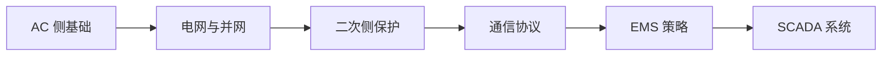

# 🔋 BESS 储能知识体系

> **个人定位**：锂电池储能 | 工商储 & 大储 | DC 侧熟悉 | AC 侧 / 电网 / 二次 / EMS & SCADA 偏弱
> 
> 本 MOC（Map of Content）作为知识库总纲，每个节点指向对应专题页面。

---

## 01-基础认知

- [[BESS/01-基础认知/储能行业全景图#]] — 产业链、玩家、市场格局
- [[储能技术路线对比]] — 锂电 vs 钠电 vs 液流 vs 飞轮 vs 压缩空气
- [[锂电池基础]] — 电化学原理、LFP / NCM 特性对比
- [[关键术语词典]] — SoC, DoD, SoH, C-rate, EOL, RTE ...

---

## 02-DC 直流侧 ✅ 我的强项

> 已相对熟悉，用于体系化梳理 + 查漏补缺

- [[电芯与材料]]
- [[模组 Pack 与 Rack 设计]]
- [[BMS 电池管理系统]]
- [[DCDC 与直流变换]]
- [[直流侧保护与配电]]

---

## 03-AC 交流侧 🔴 薄弱，重点学习

> PCS、逆变器、变压器、开关柜、交流保护 —— 是整个系统并网的关键

- [[PCS 储能变流器原理与拓扑]]
- [[PCS 主流厂家与产品对比]]
- [[变压器选型与保护]]
- [[电机学笔记 — 变压器基础]]
- [[交流开关柜与配电]]
-[[BESS/03-AC交流侧/开关柜]]]
- [[断路器选型]]
- [[交流侧保护配合]]
- [[有功功率、无功功率与功率因数]]
- [[PLL 锁相环]]
- [[电能质量与谐波]]
-[[电能质量设备]]]

---

## 04-电网与并网 🔴 薄弱，重点学习

> 储能的最终价值在电网侧体现

- [[电网基础知识]] — 有功/无功、频率、电压、功角
- [[并网标准与导则]] — GB/T 36547, GB/T 34120, IEEE 1547 ...
- [[涉网试验]] — 低穿、高穿、频率适应性
- [[辅助服务与电力市场]]
- [[AGC AVC 控制]]
- [[孤岛运行与黑启动]]

---

## 05-二次侧 🔴 薄弱，重点学习

> 保护、测控、通信 —— 储能电站的神经系统

- [[继电保护基础]]
- [[储能电站保护配置]]
- [[通信协议概览]] — Modbus, IEC 61850, DNP3, IEC 104
- [[IEC 61850 协议详解]]
- [[MQTT 协议基础]]
- [[菊花链通讯]]
- [[综自系统与网络架构]]
- [[时钟同步与对时]]
- [[网络安全与等保]]

---

## 06-EMS 与 SCADA 🔴 薄弱，重点学习

> 能量管理 & 数据采集监控 —— 储能的大脑

- [[EMS 功能架构]]
- [[SCADA 系统架构]]
- [[调度策略与算法]]
- [[SoC 均衡与热管理联动]]
- [[数据采集与存储]]
- [[EMS 主流厂家与方案对比]]

---

## 07-系统集成

> 把 DC + AC + 二次 + EMS 攒成一个可交付的系统

- [[集装箱设计与布局]]
- [[热管理系统]]
- [[消防系统]]
- [[BOP 辅助系统]]
- [[工厂集成与 FAT]]
- [[现场安装与 SAT]]

---

## 08-应用场景

> 储能在不同场景下的商业模式与设计差异

- [[工商储典型方案]] — 峰谷套利、需量管理、光储融合
- [[大储典型方案]] — 新能源配储、独立储能、共享储能
- [[台区储能与配网]]
- [[光储充一体化]]
- [[数据中心备电]]

---

## 09-标准与法规

- [[国标体系梳理]] — GB 36276, GB/T 36276, GB/T 34131 ...
- [[国际标准]] — IEC 62619, UL 9540, UL 1973 ...
- [[储能系统 CE 认证]]
- [[欧盟电池法规 2023-1542]]
- [[消防法规与验收]]
- [[并网合规]]

---

## 10-项目全生命周期

- [[项目开发与可研]]
- [[设计阶段]]
- [[设备采购与评标]]
- [[土建施工]]
- [[调试与并网]]
- [[运维与故障处理]]
- [[退役与回收]]

---

## 📝 学习路线建议

1. **先补 AC 侧**：理解 PCS 怎么把直流变成交流，变压器怎么接，开关柜是干嘛的
2. **再补电网**：理解有功无功、频率电压这些基本概念，看懂并网标准
3. **然后二次**：保护怎么配，通信协议怎么传数据
4. **最后 EMS/SCADA**：策略怎么调，数据怎么采

---

> 标注说明：✅ 熟悉区　🔴 薄弱区（当前重点）
